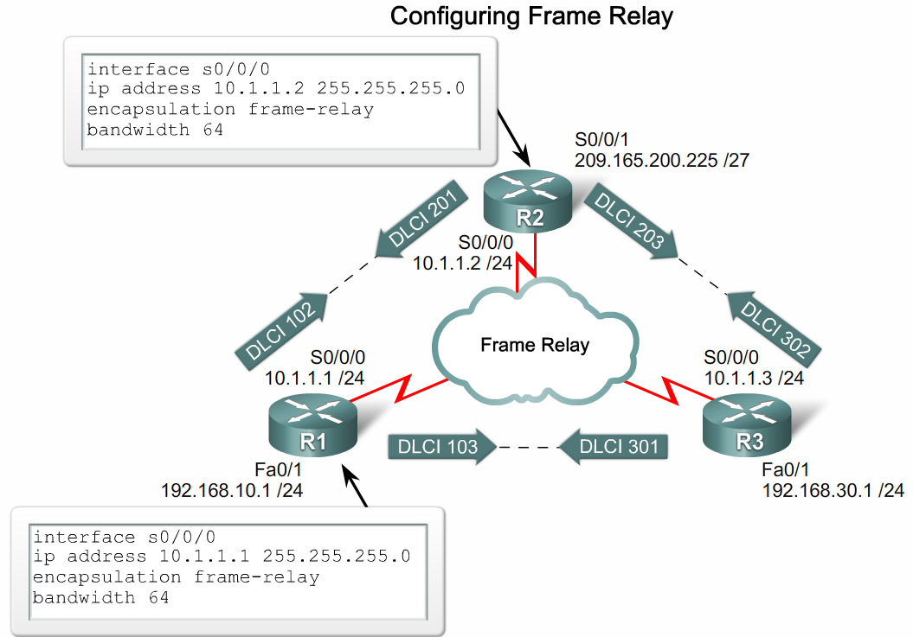
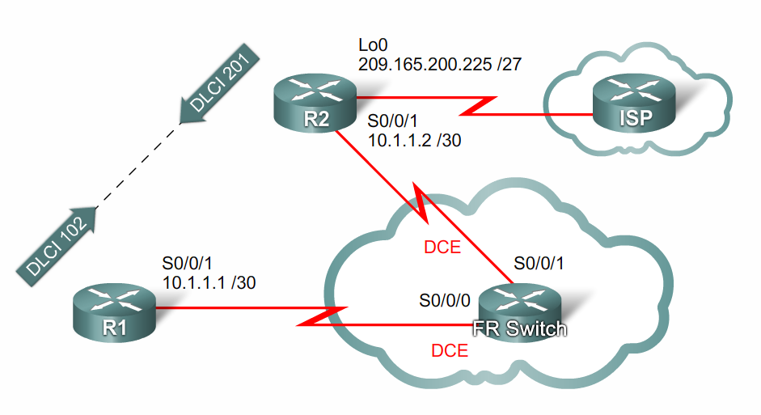
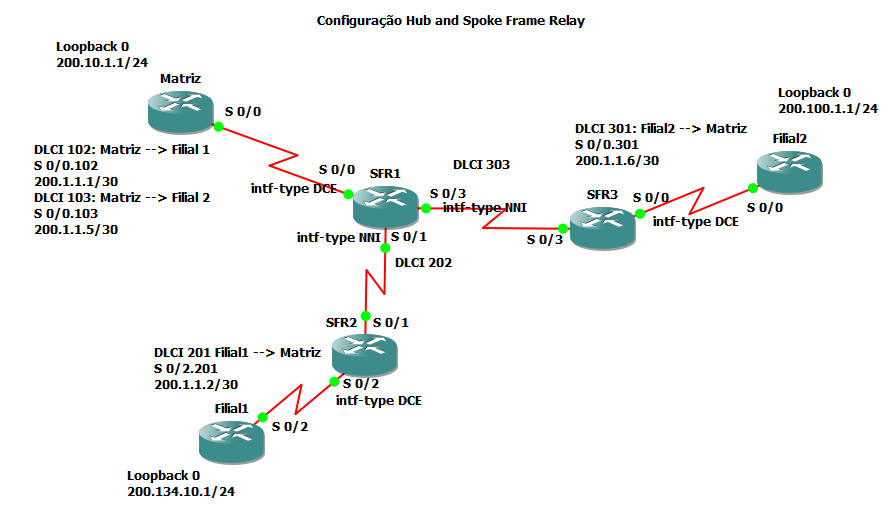
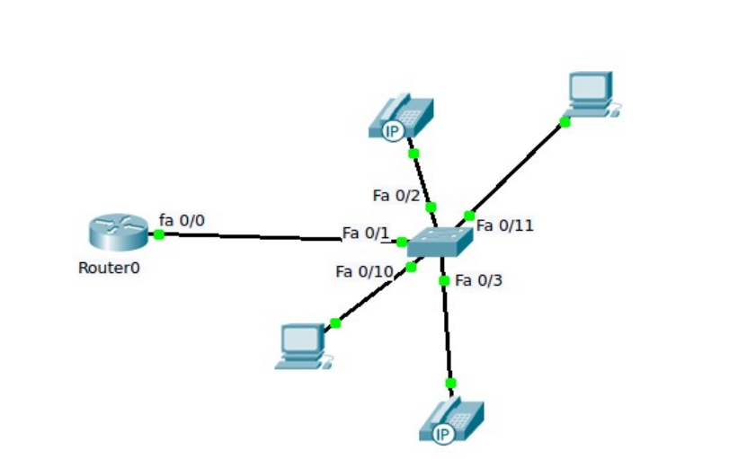
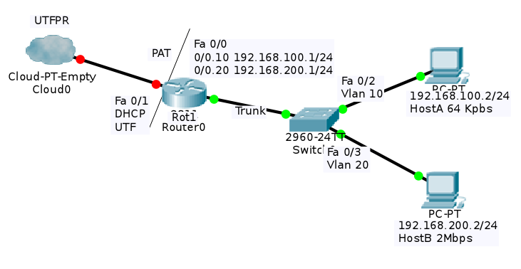

# ACL

## Processo resumido para aplicação da ACL

1. Criar a restrição;

2. Aplicar a restrição a interface;

3. Informar a direção:
	
	* inbound 	(entrando);
	* outbound	(saindo).

## Criando a Access-List

### Padrão

* Se você colocar `host` antes do ip, ele vai diretamente pra máquina;

* Se não, deve colocar o ip da rede e uma wild mask;

```ios
R (config)# access list 1 {permit|deny} host xxx.xxx.xxx.xxx
```

### Extendida

```ios
R (config)# access-list 100 {permit|deny} ip [ {host|protocolo} xxx.xxx.xxx.xxx ] \
		[ xxx.xxx.xxx.xxx wildmask]
```

## Adicionando a ACL em uma interface

```ios
R> interface serial 0/0/0
R (config)# ip access-group 1 {in|out}
```
#DHCP
# Etherchannels

* O administrador deve indicar uma interface para o etherchanel usando o comando channel-group; 

## PAgP vs LACP

* PAgP é da cisco

* LACP IEEE 802.3ad standard


## Comandos

- Channel group

- Show etherchannel

- Show pagp


## Configuração

### Ações


**Comandos**

```ios
Switch(config)# interface range interface slot/port - port
Switch(config-if-range)# channel-protocol {pagp | lacp}
Switch(config-if-range)# channel-group number mode {auto|disirable|on}
```

**Modos**


**Estático**


**PAgP**


**LACP**


# PVC frame relay

## Configuração básica de um PVC Frame Relay PVC em um roteador com interface serial.



## Configuração de um mapa estático Frame Relay



# Configuração de uma topologia de rede Frame Relay Hub and Spoke



## Configuração do Roteador da Matriz
```ios
Router#config terminal
Router(config)#hostname Matriz
Matriz(config)#interface serial 0/0
Matriz(config-if)#encapsulation frame-relay
Matriz(config-if)#no frame-relay inverse-arp
Matriz(config-if)#no shut
Matriz(config-if)#exit
Matriz(config)#interface serial 0/0.102 point-to-point
Matriz(config-subif)#ip address 200.1.1.1 255.255.255.252
Matriz(config-subif)#frame-relay interface-dlci 102
Matriz(config-fr-dlci)#exit
Matriz(config-subif)#exit
Matriz(config)#interface serial 0/0.103 point-to-point
Matriz(config-subif)#ip address 200.1.1.5 255.255.255.252
Matriz(config-subif)#frame-relay interface-dlci 103
Matriz(config-fr-dlci)#exit
Matriz(config-subif)#exit
Matriz(config)#interface loopback 0
Matriz(config-if)#ip address 200.10.1.1 255.255.255.0
Matriz(config-if)#no shut
Matriz(config-if)#exit
Matriz(config)#
```

## Configuração do roteador da Filial 1
```ios
Router>enable
Router#config terminal
Router(config)#hostname Filial1
Filial1(config)#interface serial 0/2
Filial1(config-if)#encapsulation frame-relay
Filial1(config-if)#no frame-relay inverse-arp
Filial1(config-if)#no shutdown
Filial1(config-if)#exit
Filial1(config)#
Filial1(config)#interface serial 0/2.201 point-to-point
Filial1(config-subif)#
Filial1(config-subif)#ip address 200.1.1.2 255.255.255.252
Filial1(config-subif)#frame-relay interface-dlci 201
Filial1(config-fr-dlci)#exit
Filial1(config-subif)#exit
Filial1(config)#interface loopback 0
Filial1(config-if)#ip address 200.134.10.1 255.255.255.0
Filial1(config-if)#end
Filial1#
```

## Configuração do roteador da Filial 2

```ios
Router>enable
Router#config terminal
Router(config)#hostname Filial2
Filial2(config)#interface serial 0/0
Filial2(config-if)#encapsulation frame-relay
Filial2(config-if)#no frame-relay inverse-arp
Filial2(config-if)#no shut
Filial2(config-if)#clock rate 640
Filial2(config-if)#exit
Filial2(config)#interface serial 0
Filial2(config)#interface serial 0/0.301 point-to-point
Filial2(config-subif)#ip address 200.1.1.6 255.255.255.252
Filial2(config-subif)#frame-relay interface-dlci 301
Filial2(config-fr-dlci)#exit
Filial2(config-subif)#exit
Filial2(config)#interface loopback 0
Filial2(config-if)#ip address 200.100.1.1 2
Filial2(config-if)#ip address 200.100.1.1 255.255.255.0
Filial2(config-if)#no shut
Filial2(config-if)#end
Filial2#
```

## Configuração do Switch Frame Relay 1

```ios
SFR1#config terminal
SFR1(config)#hostname SFR1
SFR1(config)#frame-relay switching
SFR1(config)#interface serial 0/0
SFR1(config-if)#encapsulation frame-relay
SFR1(config-if)#no frame-relay inverse-arp
SFR1(config-if)#frame-relay intf-type dce
SFR1(config-if)#frame-relay route 102 interface serial 0/1 202
SFR1(config-if)#frame-relay route 103 interface serial 0/3 303
SFR1(config-if)#clock rate 64000
SFR1(config-if)#no shut
SFR1(config-if)#exit
SFR1(config)#interface serial 0/1
SFR1(config-if)#encapsulation frame-relay
SFR1(config-if)#no frame-relay inverse-arp
SFR1(config-if)#frame-relay intf-type nni
SFR1(config-if)#frame-relay route 202 interface serial 0/0 102
SFR1(config-if)#clock rate 64000
SFR1(config-if)#no shut
SFR1(config-if)#exit
SFR1(config)#interface serial 0/3
SFR1(config-if)#encapsulation frame-relay
SFR1(config-if)#no frame-relay inverse-arp
SFR1(config-if)#frame-relay intf-type nni
SFR1(config-if)#frame-relay route 303 interface serial 0/0 103
SFR1(config-if)#clock rate 64000
SFR1(config-if)#no shut
SFR1(config-if)#end
SFR1#
```

## Configuração do Switch Frame Relay 2

```ios
SFR2#config terminal
SFR2(config)#frame-relay switching
SFR2(config)#interface serial 0/1
SFR2(config-if)#encapsulation frame-relay
SFR2(config-if)#no frame-relay inverse-arp
SFR2(config-if)#clock rate 64000
SFR2(config-if)#frame-relay intf-type nni
SFR2(config-if)#frame-relay route 202 interface serial 0/2 201
SFR2(config-if)#no shut
SFR2(config-if)#exit
SFR2(config)#
SFR2(config)#interface serial 0/2
SFR2(config-if)#encapsulation frame-relay
SFR2(config-if)#no frame-relay inverse-arp
SFR2(config-if)#frame-relay intf-type dce
SFR2(config-if)#frame-relay route 201 interface serial 0/1 202
SFR2(config-if)#clock rate 64000
SFR2(config-if)#no shut
SFR2(config-if)#
SFR2(config-if)#end
SFR2#wr
```

## Configuração do Switch Frame Relay 3

```ios
SFR3#configure terminal
SFR3(config)#frame-relay switching
SFR3(config)#interface serial 0/3
SFR3(config-if)#encapsulation frame-relay
SFR3(config-if)#no frame-relay inverse-arp
SFR3(config-if)#clock rate 64000
SFR3(config-if)#frame-relay intf-type nni
SFR3(config-if)#frame-relay route 303 interface serial 0/0 301
SFR3(config-if)#no shut
SFR3(config-if)#exit
SFR3(config)#interface serial 0/0
SFR3(config-if)#encapsulation frame-relay
SFR3(config-if)#no frame-relay inverse-arp
SFR3(config-if)#frame-relay intf-type dce
SFR3(config-if)#clock rate 64000
SFR3(config-if)#frame-relay route 301 interface serial 0/3 303
SFR3(config-if)#no shutConfiguração do Roteador da Matriz
Router#config terminal
Router(config)#hostname Matriz
Matriz(config)#interface serial 0/0
Matriz(config-if)#encapsulation frame-relay
Matriz(config-if)#no frame-relay inverse-arp
Matriz(config-if)#no shut
Matriz(config-if)#exit
Matriz(config)#interface serial 0/0.102 point-to-point
Matriz(config-subif)#ip address 200.1.1.1 255.255.255.252
Matriz(config-subif)#frame-relay interface-dlci 102
Matriz(config-fr-dlci)#exit
Matriz(config-subif)#exit
SFR3(config-if)#end
SFR3#
```

## Configuração do protocolo de roteamento OSPF

```ios
Matriz
Matriz#config terminal
Matriz(config)#router ospf 1
Matriz(config-router)#network 200.10.1.0 0.0.0.255 area 0
Matriz(config-router)#network 200.1.1.0 0.0.0.3 area 0
Matriz(config-router)#network 200.1.1.4 0.0.0.3 area 0
Matriz(config-router)#end
```

## Filial 1

```ios
Filial1>enable
Filial1#config terminal
Filial1(config)#route ospf 1
Filial1(config)#router ospf 1
Filial1(config-router)#network 200.134.10.0 0.0.0.255 area 0
Filial1(config-router)#network 200.1.1.0 0.0.0.3 area 0
Filial1(config-router)#end
Filial1#
```

## Filial 2

```ios
Filial2>enable
Filial2#config terminal
Filial2(config)#router ospf 1
Filial2(config-router)#network 200.100.1.0 0.0.0.255
Filial2(config-router)#network 200.100.1.0 0.0.0.255 area 0
Filial2(config-router)#network 200.1.1.4 0.0.0.3 area 0
Filial2(config-router)#end
Filial2#
```

## Verificando as configurações:

```ios
Matriz#show frame-relay map
Serial0/0.102 (up): point-to-point dlci, dlci 102(0x66,0x1860), broadcast
          status defined, active
Serial0/0.103 (up): point-to-point dlci, dlci 103(0x67,0x1870), broadcast
          status defined, active
Matriz#

Matriz#show ip route
Codes: C - connected, S - static, R - RIP, M - mobile, B - BGP
       D - EIGRP, EX - EIGRP external, O - OSPF, IA - OSPF inter area
       N1 - OSPF NSSA external type 1, N2 - OSPF NSSA external type 2
       E1 - OSPF external type 1, E2 - OSPF external type 2
       i - IS-IS, su - IS-IS summary, L1 - IS-IS level-1, L2 - IS-IS level-2
       ia - IS-IS inter area, * - candidate default, U - per-user static route
       o - ODR, P - periodic downloaded static route

Gateway of last resort is not set

     200.1.1.0/30 is subnetted, 2 subnets
C       200.1.1.0 is directly connected, Serial0/0.102
C       200.1.1.4 is directly connected, Serial0/0.103
C    200.10.1.0/24 is directly connected, Loopback0
     200.100.1.0/32 is subnetted, 1 subnets
O       200.100.1.1 [110/65] via 200.1.1.6, 00:06:33, Serial0/0.103
     200.134.10.0/32 is subnetted, 1 subnets
O       200.134.10.1 [110/65] via 200.1.1.2, 00:06:33, Serial0/0.102

Matriz#show frame-relay pvc

PVC Statistics for interface Serial0/0 (Frame Relay DTE)

              Active     Inactive      Deleted       Static
  Local          2            0            0            0
  Switched       0            0            0            0
  Unused         0            0            0            0

DLCI = 102, DLCI USAGE = LOCAL, PVC STATUS = ACTIVE, INTERFACE = Serial0/0.102

  input pkts 119           output pkts 130          in bytes 19887
  out bytes 21642          dropped pkts 0           in pkts dropped 0
  out pkts dropped 0                out bytes dropped 0
  in FECN pkts 0           in BECN pkts 0           out FECN pkts 0
  out BECN pkts 0          in DE pkts 0             out DE pkts 0
  out bcast pkts 110       out bcast bytes 19562
  5 minute input rate 0 bits/sec, 0 packets/sec
  5 minute output rate 0 bits/sec, 0 packets/sec
  pvc create time 00:54:05, last time pvc status changed 00:39:42

DLCI = 103, DLCI USAGE = LOCAL, PVC STATUS = ACTIVE, INTERFACE = Serial0/0.103

  input pkts 101           output pkts 120          in bytes 16648
  out bytes 20555          dropped pkts 0           in pkts dropped 0
  out pkts dropped 0                out bytes dropped 0
  in FECN pkts 0           in BECN pkts 0           out FECN pkts 0
  out BECN pkts 0          in DE pkts 0             out DE pkts 0
  out bcast pkts 105       out bcast bytes 18995
  5 minute input rate 0 bits/sec, 0 packets/sec
  5 minute output rate 0 bits/sec, 0 packets/sec
  pvc create time 00:53:14, last time pvc status changed 00:11:46
Matriz#
```
# Roteador

 ```ios
R> enable
R(config)# config terminal
R(config)# ipv6 unicast-routing 
R(config)# interface fa 0/1
R(config-if)# ipv6 enable
R(config-if))# ipv6 address 2001:dbb1:1:1::1/64
R(config-if)# no shut
R(config-if)# exit
 ```

## ativar o rip

### Na interface

```ios
R(config-if)# ipv6 rip nrede enable
```

### Na configuração global 

Onde *nrede* é uma palavra chave

 ```ios
R (config) # ipv6 router rip nrede
 ```
# NAT

```ios
Router(config)# int fa 0/1
Router(config)# ip nat outside
Router(config)# exit 
Router(config)# interface fa 0/0
Router(config)# ip address ..
Router(config)# ip nat inside 
Router(config)# access-list 1 permit 192.168.1.0 0.0.0.255
Router(config)# access-list 1 permit 200.1.1.0 0.0.0.3
Router(config)# ip nat inside source list 1
Router(config)# interface fa 0/1
Router(config)# overload
```
# QoS

## Configuração de uma rede VoIP

Vamos configurar uma rede com a seguinte topologia:



### Configuração do Switch

```ios
Switch(config)#interface range fa0/1 – 5
Switch(config-if-range)#switchport mode access
Switch(config-if-range)#switchport voice vlan 1
```

### Configuração do roteador 2811 com o CME:

```ios
Router(config)#int fa 0/0
Router(config-if)#ip add 192.168.10.1 255.255.255.0
Router(config-if)#no shutdown
Router(config-if)#exit
Router(config)#ip dhcp pool voicelab
Router(dhcp-config)#network 192.168.10.0 255.255.255.0
Router(dhcp-config)#default-router 192.168.10.1
Router(dhcp-config)#option 150 ip 192.168.10.1
Router(dhcp-config)#exit
Router(config)#telephony-service
Router(config-telephony)#max-dn 5
Router(config-telephony)#max-ephones 5
Router(config-telephony)#ip source-address 192.168.10.1 port 2000
Router(config-telephony)#auto assign 1 to 5
Router(config-telephony)#exit
Router(config)#ephone-dn 1
Router(config-ephone-dn)#number 54001
Router(config-ephone-dn)#exit
Router(config)#ephone-dn 2
Router(config-ephone-dn)#number 54002
Router(config-ephone-dn)#
Router(config)#ephone-dn 3
Router(config-ephone-dn)#number 11111
```

### Configuração da Qualidade de Serviço (QoS) no Switch 2960


```ios
Switch#configure terminal
Switch(config)#mls qos
Switch(config)#interface range fastEthernet 0/1-5
Switch(config-if-range)#mls qos
Switch(config-if-range)#mls qos cos 5
Switch(config-if-range)#mls qos trust cos
Switch(config-if-range)#exit
Switch(config)#interface range fastEthernet 0/10-22
Switch(config-if-range)#mls qos
Switch(config-if-range)#mls qos cos 0
Switch(config-if-range)#mls qos trust cos
Switch(config-if-range)#exit
Switch(config)#end
Switch#wr
```

# Policing 

## Topologia



## Básico

```ios
Rot1(config)#interface fa 0/1
Rot1(config-if)#ip address dhcp
Rot1(config-if)#description Link para UTFPR
Rot1(config-if)#ip nat outside
Rot1(config-if)#no shutdown
Rot1(config-if)#exit
Rot1(config)#interface fa 0/0
Rot1(config-if)#no shutdown
Rot1(config-if)#exit
Rot1(config)#interface fa 0/0.10
Rot1(config-if)#encapsulation dot1q 10
Rot1(config-if)#ip address 192.168.100.1 255.255.255.0
Rot1(config-if)#ip nat inside
Rot1(config-if)#exit
Rot1(config)#interface fa 0/0.20
Rot1(config-if)#encapsulation dot1q 20
Rot1(config-if)#ip address 192.168.200.1 255.255.255.0
Rot1(config-if)#ip nat inside
Rot1(config-if)#exit
Rot1(config)#ip route 0.0.0.0 0.0.0.0 10.15.2.254
Rot1(config)#access-list 1 permit 192.168.0.0 0.0.255.255
Rot1(config)#ip nat inside source list 1 interface fa 0/1 overload
```

## Configuração Policing

```ios
Rot1(config)#ip access-list extended HostA
Rot1(config-ext-nacl)#permit ip any host 192.168.100.2
Rot1(config-ext-nacl)#permit ip host 192.168.100.2 any
Rot1(config-ext-nacl)#exit
Rot1(config)#class-map match-all HA
Rot1(config-cmap)#match access-group name HostA
Rot1(config-cmap)#exit
Rot1(config)#policy-map QoS1
Rot1(config-pmap)#class HA
* Rot1(config-pmap-c)#police rate 64000 bps
Rot1(config-pmap-c-police)#end
Rot1#config terminal
Rot1(config)#interface fa 0/0.10
Rot1(config-if)#service-policy output QoS1
```

### Configuração Shapping

* Ao invés de police rate ... Na linha

```ios
Rot1(config-pmap-c)#police rate 64000 bps
```

* Colocar:

```ios
Rot1(config-pmap-c)#shape average 128000
```


## Continuação...
```ios
Rot1(config)#ip access-list extended HostB
Rot1(config-ext-nacl)#permit ip any host 192.168.200.2
Rot1(config-ext-nacl)#permit ip host 192.168.200.2 any
Rot1(config-ext-nacl)#exit
Rot1(config)#class-map match-all HB
Rot1(config-cmap)#match access-group name HostB
Rot1(config-cmap)#exit
Rot1(config)#policy-map QoS2
Rot1(config-pmap)#class HB
Rot1(config-pmap-c)#police rate 2000000 bps
Rot1(config-pmap-c-police)#end
Rot1#config terminal
Rot1(config)#interface fa 0/0.20
Rot1(config-if)#service-policy output QoS2
```

# EIGRP 1
```ios
R(config)#router eigrp 1
R(config-router)#network 192.168.1.0
R(config-router)#network 200.1.1.0
R(config-router)#end
R#wr
```

# OSPF

*Atenção: a máscara é invertida, i.e., wildmask*

ex: /24 Ao invés de ser 255.255.255.0 é 0.0.0.255

```ios
R(config)# router ospf 1
R(config-router)# network 192.168.1.0 0.0.0.255 area 0
R(config-router)# end
```
#Segurança de porta

##Violações:

	* Protect

	* Restrict

	* Shutdown

##Observações:
	
	* Somente modo acesso

	* Existe estático e dinâmico

##Estático:

```
switchport port-security mac-address AA:AA:AA:AA:00:00:00:01
switchport maximum 1
switchport violation shutdown #desliga a interface se houver uma violação
```
##Dinâmico:

	Apenas não específicar o mac

```
switchport maximum 100 
switchport violation shutdown #desliga a interface se houver uma violação
```

#DHCP - snooping

```
ip dhcp snooping
ip dhcp snooping vlan 10
inteface range f0/1-10
ip dhcp snooping limit rate 5
interface g0/1
ip dhcp snooping trust
end
show ip dhcp snooping
```

# SSH

```
S# vlan 30 
S# ip domain-name X 
S# username fabiano privilege 15 password CISCO
S#line vty 0 4
#transport input telnet/ssh/all 

#enable secret UTFPR (pede a senha pra entrar no modo privilegiado) 
#hostname SwitchX 
#ip domain-name www.utfpr.edu.br 
#username NOME priv 15 password UTFPR 
#crypto key generate rsa 
#line vty 0 4 (5 conexões simultaneas) 
#transport input ssh 
#login local 
```
(para acesso remoto das vlans acesse vlan.md)


# STP

## No switch que será o root

```ios
Switch>enable
Switch#config terminal
Switch(config)#spanning-tree vlan 1 root primary
Switch(config)#end
Switch#
```

## Nos switches que serão secundários

```ios
Switch>enable
Switch#config terminal
Switch(config)#spanning-tree vlan 1 root secondary
Switch(config)#end
Switch#
Switch#
```

## Para configurar o switch na topologia desativando o protocolo Spanning Tree (STP). Tem somente a Vlan 1 (padrão) configurada.

```ios
Switch>enable
Switch#config terminal
Enter configuration commands, one per line. End with CNTL/Z.
Switch(config)#no spanning-tree vlan 1
Switch(config)#end
Switch#
wr
Building configuration...
[OK]
Switch#
```
# TFPT

* Arquivo de configuração do TFTP:

`/etc/default/tftpd-hpa`

* Pasta padrão do servidor tftp:

`/home/tftp/`

* Iniciar, reinicializar ou desligar o deamon do TFTP:

```shell
/etc/init.d/tftpd-hpa {start|restart|stop|force-reload|status}
```

* *Exemplo*: copiar o arquivo running-config do sistema para o servidor

```ios
copy system:running-config tftp
```
# TUNELAMENTO

## Túnel 6in4

```ios
router> enable
router# config t
router(config)# interface tunnel 0
router(config-if)# ipv6 address fd00:cafe::0/127
router(config-if)# tunnel source serial x/x/x
router(config-if)# tunnel destination 203.0.113.6
router(config-if)# tunnel mode ipv6ip
router(config-if)# ipv6 route 2001:db8:cafe:2::/64 fd00:cafe::1
```
# Útil

Comandos que podem ser úteis no gerenciamento e configuração das redes

**Range de intefaces**

```ios
# interface range fa 0/0-10
```

## Dá pra separar por vírgulas

```ios
# interface range fa 0/1, fa 0/3, fa0/5
```

**Mostra configuração geral**

```ios
# show running-config
```

**Mostra as vlans e suas intefaces designadas**

```
# show vlan brief
```

```
# show vlan
```


**Mostra a tabela MAC | INTERFACE do switch**
```
show mac-addres table
```

**Hostname**

```
#hostname zoera
```

**DEBUG**

```ios
debug <o que você quer debugar>
```

*exemplos*

```ios
debug arp
debug dhcp
debug port-security
debug all
```

OBS.: `debug all` não é recomendado

**Sair do debug**

```ios
undebug <o que você quer desbugar>
```

```ios
undebug arp
undebug dhcp
undebug ppp
undebug all
```

## Gravações/exclusões de configuração

`Ram` armazena running-config 

`nVran` armazena startup-config 

`Flash` armazena SO e vlan.dat (conteúdo das vlans) 

### Gravar Ram -> vRam 

```
#copy running-config startup-config 
```
OR 

```
#wr 
```
 
### Apagar tudo: 

```
#erase startup-config 
#delete flash:vlan.dat 
#reload 
```

# Recuperação de dispositivos

## Recuperar senhas

### No roteador

1. Fazer a conexão com o equipamento utilizando o cabo serial e o kermit;

2. Reinicializar fisicamente o roteador;

3. Acessar o modo Rommon no roteador: Após 5 segundos, pressionar simultaneamente as teclas  Ctrl-\l ou Ctrl-\b. Este procedimento interrompe a sequência normal do boot e inicia o Rom Monitor.

```ios
rommon >
```

4. Alterar o registro de configuração para o valor 0x2142. Com isto, na reinicialização do roteador o equipamento não vai carregar a configuração da NVRAM. Com isto as configurações salvas não serão carregadas e não haverá senha para entrar no roteador.

```ios
rommon> confreg 0x2142
rommon> reset
```

5. Apenas digitar *enable*, não precisa digitar a senha

```ios
router> enable
router# copy startup-config running-config
```

* A partir deste ponto toda a configuração da NVRAM estará na RAM e poderá ser alterada, inclusive a senha.

### No switch

1. Desligar o switch da tomada e segurar o botão switch old.

2. Nesse modo, existem 3 comandos:

```ios
flash_init

load_helper

boot
```

* Fazer os comandos nessa ordem, flash\_init, load\_helper, então renomear o arquivo config.text e, então, executar o comando boot:

```ios
flash_init
load_helper
rename flash:config.text flash:config.old
boot
```

* Então você será logado ao sistema normal, como se tivesse comprado agora o dispositivo.

* Renomear, por fim, o arquivo config.old para config.text, depois copiar config.text pra running-config:

```ios
copy flash:config.old flash:config.text
copy flash:config.text system:running-config
```

## IOS apagado

* Setar as configurações de rede do roteador, iniciar servidor tftp, setar o nome do .bin em um servidor tftp, setar ip de servidor tftp e baixar o arquivo pela rede.

* **EXEMPLO**

```ios
rommon > IP_SUBNET_MASK=255.255.255.0
rommon > DEFAULT_GATEWAY=171.68.170.3
rommon > TFTP_FILE=c2600-is-mz.113.2.0
rommon > tftpdn1d
```
#VLANS

##Criar vlans

```
S(config)# vlan <1-1005>
S(config-vlan)# name avelã
```

##Access Mode

```
S(config-if)# switchport mode access
S(config-if)# switchport access vlan <1-1005>
```

##Trunk Mode

```
S(config-if)# switchport mode trunk
S(config-if)# switchport trunk allowed vlan <1-1005>
```

	Há também os comandos add, all, onde all adiciona uma nova vlan na lista atual, e all adiciona todas.

##Roteamento de vlans

##Sem subintefaces
	
	* 1 interface pra cada vlan

	* Switch -> roteador
	- Mode *acess* e vlan que irá passar pela inteface 

	* Roteador -> Switch
	- Seta o ip da interface pra cada vlan

##Com subintefaces

* Uma interface para várias vlans

* Switch -> roteador

	- Tronco e autorizar todas as vlans daquela interface/

* Roteador -> switch

	- Subinterfaces;

	- Só dá um "no shut" para subir a interface

	- Encapsulation dot1q nas subinterfaces

	- Gateway default de todas as vlans

### Comandos

```
router>enable
router#config terminal
router(config)#interface fa 0/0
router(config-if)#no shutdown
router(config)#interface fa 0/0.10
router(config-if)#encapsulation dot1q 10
router(config-if)#ip address 10.0.0.1 255.0.0.0
router(config-if)#exit
router(config)#interface fa 0/0.20
router(config-if)#encapsulation dot1q 20
router(config-if)#ip address 172.17.0.1 255.255.0.0
router(config-if)#exit
router(config)#interface fa 0/0.30
router(config-if)#encapsulation dot1q 30
router(config-if)#ip address 192.168.1.1 255.255.255.0
```

```
switch>enable
switch#config terminal
switch(config)#vlan 10
switch(config-vlan)#name Funcionarios
switch(config-vlan)#vlan 20
switch(config-vlan)#name Convidados
switch(config-vlan)#vlan 30
switch(config-if)#name Gerencia
switch(config-vlan)#exit
switch(config)#interface fa 0/1
switch(config-if)#switchport mode access
switch(config-if)#switchport mode access
switch(config-if)#switchport access vlan 10
switch(config-if)#exit
switch(config)#interface fa 0/24
switch(config-if)#switchtport mode trunk
switch(config-if)#switchport trunk vlan 10,20,30
```

# IP da vlan para acesso remoto

```  
#interface vlan 20 
#ip address 200.1.1.200 255.255.255.0 
#no shut 
```
# Protocolos da camada 2

## Analogia da diferença do PAP e CHAP

``Pense como a diferença do ssh e do telnet, analogamente``

## PPP com PAP

PPP é um protocolo aberto

```ios
R1 (config)#	username R2
		password utfpr
R1 (config)# inter se 0/0/0
R1 (config-if)# encapsulation ppp
R1 (config-if)# ppp pap sent-username R1 password utfpr
```

## PPP com CHAP

```ios
R2 (config)# interface serial 0/1/0
R2 (config)# encapsulation ppp
R2 (config)# ppp authentication chap
R2 (config)# exit
R2 (config)# username R2 password utfpr
R2 (config)# username R3 password utfpr
```

## HDLC

```ios
R3 (config)# interface serial 0/0/0
R3 (config-if)# encapsulation hdlc
```
