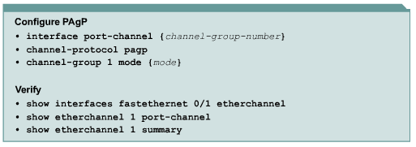
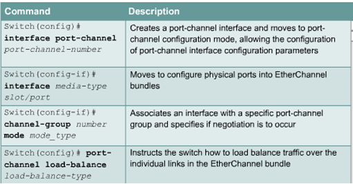
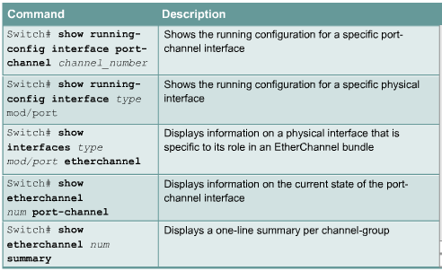
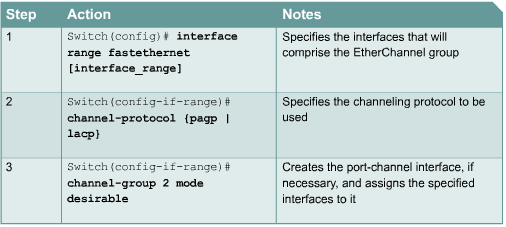
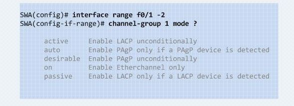
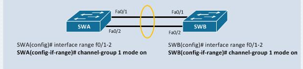
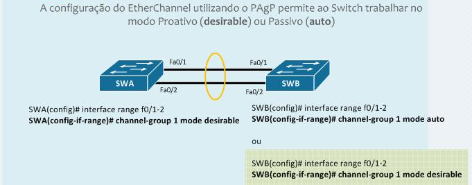
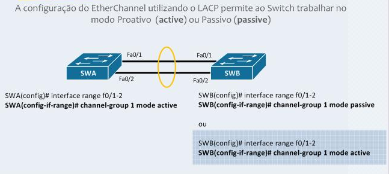

# Etherchannels

* O administrador deve indicar uma interface para o etherchanel usando o comando channel-group; 

## PAgP vs LACP

* PAgP é da cisco

* LACP IEEE 802.3ad standard


## Comandos

- Channel group

- Show etherchannel

- Show pagp





## Configuração

### Ações



**Comandos**

```ios
Switch(config)# interface range interface slot/port - port
Switch(config-if-range)# channel-protocol {pagp | lacp}
Switch(config-if-range)# channel-group number mode {auto|disirable|on}
```

**Modos**



**Estático**



**PAgP**



**LACP**


